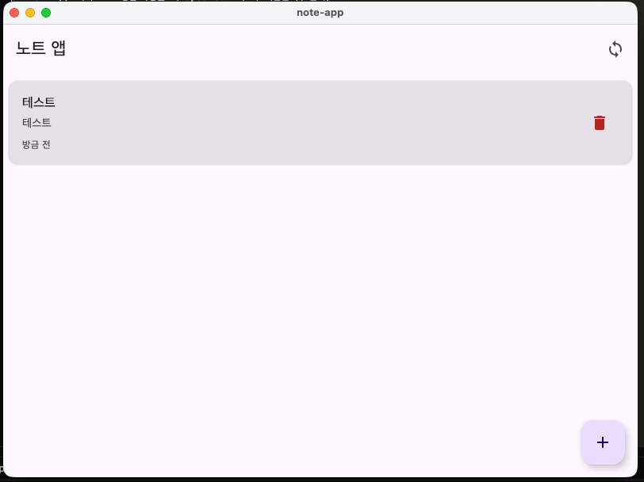

# 📝 오프라인-퍼스트 노트 앱  
*Kotlin Multiplatform + Compose Multiplatform 해커톤 템플릿*

이 프로젝트는 **Kotlin Multiplatform(KMP)** 과 **Compose Multiplatform** 을 사용하여  
**Desktop + Android** 환경에서 작동하는 간단한 오프라인-퍼스트 메모장 앱 템플릿입니다.

“낯선 기술 기반 해커톤”이라는 콘셉트를 반영해  
UI/로직을 공유하고, 간단한 Last-Write-Wins(LWW) 방식의 동기화를 지원합니다.

---

## 📌 목적
- Kotlin Multiplatform + Compose 기반의 프로젝트 구조를 빠르게 경험
- Android & Desktop에서 공통 UI/로직 사용하기
- 오프라인에서도 완전히 동작하는 노트 앱 만들기
- 버튼 기반 Sync 구조로 MPP 개발 흐름 익히기

---

## 🚀 핵심 기능

### 1. 노트 CRUD

- 노트 목록 보기
- 노트 생성/수정/삭제
- 수정 시 자동으로 `updatedAt` 갱신

### 2. 오프라인-퍼스트 저장
- 플랫폼 별 파일 저장소에 JSON 직렬화하여 저장  
  (예: `notes.json`)
- 앱 껐다 켜도 데이터 유지
- 네트워크 필요 없음

### 3. 동기화 버튼 (Last-Write-Wins)
- 상단 "Sync" 버튼 클릭으로 동작
- Push: 로컬 → 서버 (`server.json`)
- Pull: 서버 → 로컬
- 충돌 시 **최신 수정 시각(updatedAt)이 우선**

서버는 실제 서버가 아닌 해커톤 데모용 **로컬 파일 기반 Fake Server** 구조입니다.

---

## 🛠 기술 스택

### 공통(KMP)
- Kotlin Multiplatform
- Compose Multiplatform
- kotlinx.serialization
- kotlinx.datetime
- File I/O API

### Android
- Jetpack Compose(Android)
- Android Studio / IntelliJ IDEA

### Desktop
- Compose Desktop
- JVM 17+

---

## 📂 프로젝트 구조

```
project-root
├── commonMain
│    ├── data
│    │     ├── Note.kt
│    │     ├── NotesRepository.kt
│    │     ├── SyncService.kt
│    ├── ui
│    │     ├── NoteListScreen.kt
│    │     ├── NoteEditorScreen.kt
│    │     └── App.kt
│
├── androidApp
│    └── MainActivity.kt
│
├── desktopApp
│    └── Main.kt
│
├── notes.json      # 로컬 저장 파일
└── server.json     # Fake 서버 JSON
```